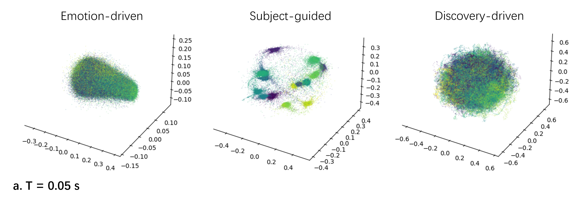
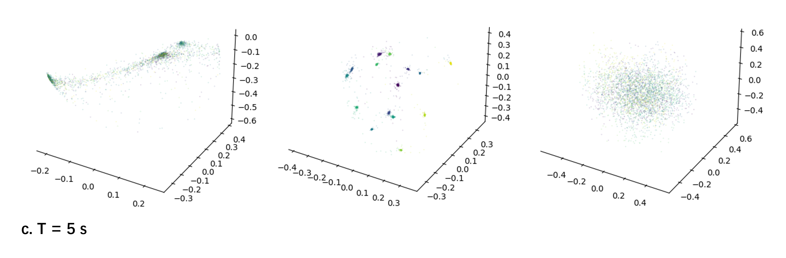
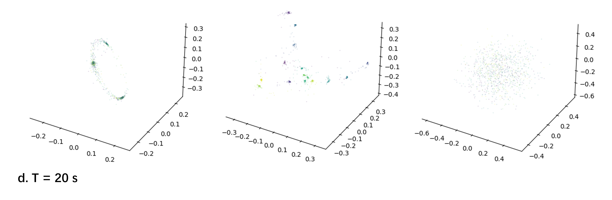

# Investigating the EEG Embedding by Visualization

This repository is the official implementation of the paper: 'Consistent and Identifiable Latent Embedding of EEG Time-domain Features using Contrastive Learning'

The following sections guide you through cloning the project, preparing the dataset, setting up the environment, and running the code.

## Clone the Project

Clone the repository using the following command:
```
git clone https://github.com/liangfengsid/timeEegContrastive.git
cd visContrastive
```

## Dataset Preparation

Place the [SEED dataset](https://bcmi.sjtu.edu.cn/~seed/seed.html) into the `./data` directory. This dataset is used for training and evaluating the models.

## Environment Setup

Create a virtual environment and install the required dependencies with the following commands:
```
conda create -n visContrastive python=3.11 pytorch=2.0.0
conda activate visContrastive
pip install -r requirements.txt -i https://pypi.tuna.tsinghua.edu.cn/simple
```
This sets up an environment with the necessary libraries and packages for the project.

## Running the Code

### Data Preprocessing
Execute the following command for data preprocessing, including feature extraction and dataset splitting:
```
python main.py preprocess config.yaml
```

### Model Training
Train the model to obtain latent embeddings with:
```
python main.py train config.yaml
```


### Visualization
Decode using the SVM model on different embeddings and perform classification tasks with:
```
python main.py visualize config.yaml
```






Refer to the configurations in `config.yaml` to customize the training and other processes.

## Support & Contribution

Feel free to open issues or contribute to the project. Your feedback is highly appreciated.
